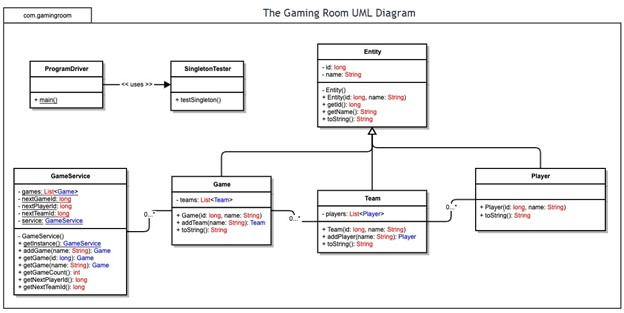

# Draw It or Lose It
A web-based game called "Draw It or Lose It" designed to be served on multiple platforms.

# Q/A Portfolio
Briefly summarize The Gaming Room client and their software requirements. Who was the client? What type of software did they want you to design? 
The Gaming Room is a gaming studio that wants to develop a web-based, multiplayer game that serves multiple platforms based on their current game called “Draw It or Lose It.” The target platforms are desktop browsers (Linux, Windows, macOS) and mobile browsers. The game app should have given a game the ability to have one or more teams involved, each team having multiple players assigned to it, game and team names must be unique, and only one instance of the game can exist in memory at any given time.

What did you do particularly well in developing this documentation? 
---
I did quite well in: 
    • Summarizing the purpose of the project, which involves the client’s goals.
    • Explaining the organizational and technical requirements of The Gaming Room project.
    • Identifying the design constraints, which include the software requirements, network latency, concurrency control, scalability, security, and cross-platform compatibility.
    • Explaining the role of each class component of the domain model and connecting each OOP principle to what was present in the model.
    • Evaluating the development requirements of Mac, Linux, Windows, and mobile devices based on the server-side, client-side, and development tools.
    • Documented recommendations on the operating platform, operating systems architectures, logical architecture, data architecture, storage management, memory management, distributed systems and networks, and security.
      
What about the process of working through a design document did you find helpful when developing the code?: 
---
I found that the domain model, design constraints, and brief descriptions of each class component in the software system. It helped me understand the broader goals of the software system and how each connected component needed to function to meet the project requirements.

If you could choose one part of your work on these documents to revise, what would you pick? How would you improve it?
---
I would choose to update the evaluation section to make it more organized and clear. I could probably either choose a different format rather than a table or simply change the table content to consist of headers, lists of bullet points, and brief summaries. The format could explicitly list the cost estimation, cost variables, recommended tech stacks with pros and cons, and best practices to use.

How did you interpret the user’s needs and implement them into your software design? Why is it so important to consider the user’s needs when designing? 
---
I interpreted the user's needs by first analyzing the high-level requirements, mapping those assumptions to clear technical decisions and assumptions, and verifying things with real users and participants outside the development team. 

The user's needs matter because they heavily influence correct functionality of the system. This reduces rework, improves player retention, and improves ethical and safety considerations.

How did you approach designing software? What techniques or strategies would you use in the future to analyze and design a similar software application?
---
The approach that I used was first identifying requirements, such as identifying key characteristics: web-based, multiplayer, teams, unique names, and one in-memory instance. Then I identified implicit needs: cross-platform functionality and real-time gameplay. 

Then, I divided the system into clear services like real-time syncing through WebSocket, client UI, game manager, and matchmaking/lobby organizer. 

Finally, using the software design template, I implemented each section of the document. 

I relied on requirements analysis and system decomposition rather than any formal techniques.

# GameAuth

How to start the GameAuth application
---

1. Run `mvn clean install` to build your application
1. Start application with `java -jar target/gameauth-0.0.1-SNAPSHOT.jar server config.yml`
1. To check that your application is running enter url `http://localhost:8080`

Health Check
---

To see your applications health enter url `http://localhost:8081/healthcheck`

# Documents

GameAuth UML Diagram
---

Software Design Template
---
[Document](https://github.com/Mx-Butterscotch-they-them/Draw-It-or-Lose-It/blob/main/CS%20230%20Project%20Software%20Design%20Template%20(1).docx)
